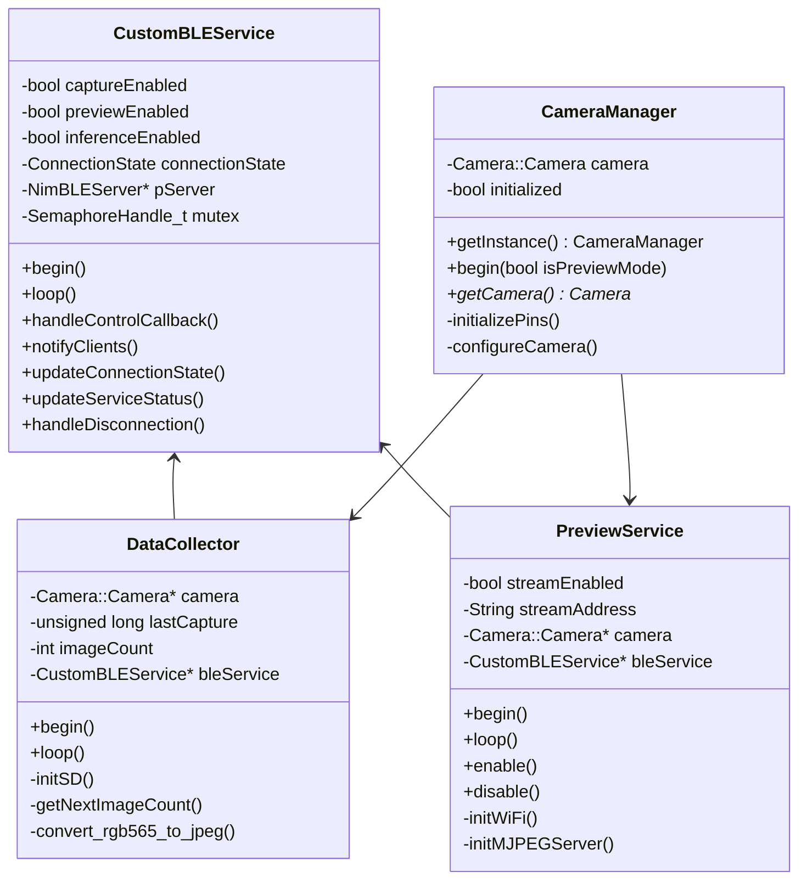

```mermaid
classDiagram
class CustomBLEService {
-bool captureEnabled
-bool previewEnabled
-bool inferenceEnabled
-ConnectionState connectionState
-NimBLEServer\* pServer
-SemaphoreHandle_t mutex
+begin()
+loop()
+handleControlCallback()
+notifyClients()
+updateConnectionState()
+updateServiceStatus()
+handleDisconnection()
}

    class CameraManager {
        -Camera::Camera camera
        -bool initialized
        +getInstance() CameraManager
        +begin(bool isPreviewMode)
        +getCamera() Camera*
        -initializePins()
        -configureCamera()
    }

    class DataCollector {
        -Camera::Camera* camera
        -unsigned long lastCapture
        -int imageCount
        -CustomBLEService* bleService
        +begin()
        +loop()
        -initSD()
        -getNextImageCount()
        -convert_rgb565_to_jpeg()
    }

    class PreviewService {
        -bool streamEnabled
        -String streamAddress
        -Camera::Camera* camera
        -CustomBLEService* bleService
        +begin()
        +loop()
        +enable()
        +disable()
        -initWiFi()
        -initMJPEGServer()
    }

    CustomBLEService <-- DataCollector
    CustomBLEService <-- PreviewService
    CameraManager --> DataCollector
    CameraManager --> PreviewService
```
