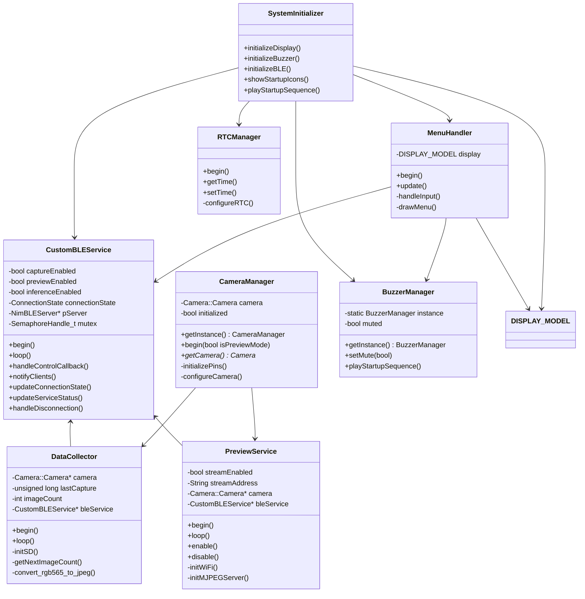

# Class Diagram

```mermaid
classDiagram
class CustomBLEService {
-bool captureEnabled
-bool previewEnabled
-bool inferenceEnabled
-ConnectionState connectionState
-NimBLEServer\* pServer
-SemaphoreHandle_t mutex
+begin()
+loop()
+handleControlCallback()
+notifyClients()
+updateConnectionState()
+updateServiceStatus()
+handleDisconnection()
}

    class CameraManager {
        -Camera::Camera camera
        -bool initialized
        +getInstance() CameraManager
        +begin(bool isPreviewMode)
        +getCamera() Camera*
        -initializePins()
        -configureCamera()
    }

    class DataCollector {
        -Camera::Camera* camera
        -unsigned long lastCapture
        -int imageCount
        -CustomBLEService* bleService
        +begin()
        +loop()
        -initSD()
        -getNextImageCount()
        -convert_rgb565_to_jpeg()
    }

    class PreviewService {
        -bool streamEnabled
        -String streamAddress
        -Camera::Camera* camera
        -CustomBLEService* bleService
        +begin()
        +loop()
        +enable()
        +disable()
        -initWiFi()
        -initMJPEGServer()
    }

    class SystemInitializer {
        +initializeDisplay()
        +initializeBuzzer()
        +initializeBLE()
        +showStartupIcons()
        +playStartupSequence()
    }

    class MenuHandler {
        -DISPLAY_MODEL display
        +begin()
        +update()
        -handleInput()
        -drawMenu()
    }

    class BuzzerManager {
        -static BuzzerManager instance
        -bool muted
        +getInstance() BuzzerManager
        +setMute(bool)
        +playStartupSequence()
    }

    class RTCManager {
        +begin()
        +getTime()
        +setTime()
        -configureRTC()
    }

    CustomBLEService <-- DataCollector
    CustomBLEService <-- PreviewService
    CameraManager --> DataCollector
    CameraManager --> PreviewService
    SystemInitializer --> MenuHandler
    SystemInitializer --> BuzzerManager
    SystemInitializer --> RTCManager
    MenuHandler --> DISPLAY_MODEL
    SystemInitializer --> CustomBLEService
    MenuHandler --> BuzzerManager
    MenuHandler --> CustomBLEService
    SystemInitializer --> DISPLAY_MODEL
```
