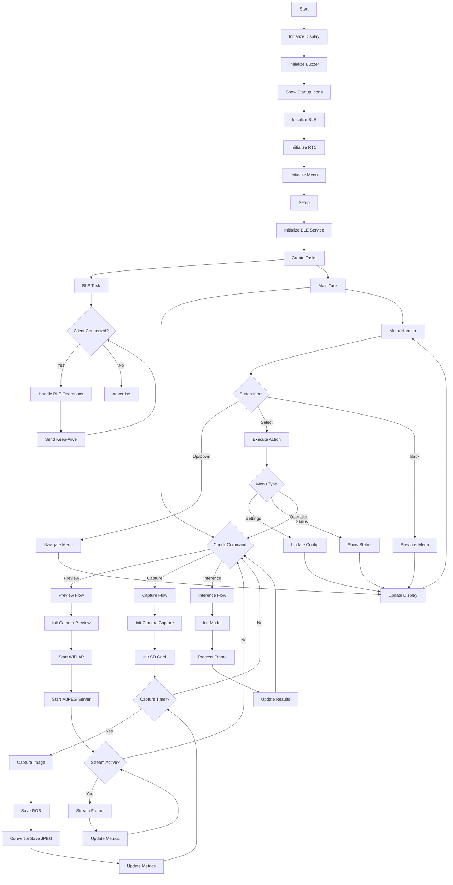

# Flow Diagram

```mermaid
graph TD
    A[Start] --> B1[Initialize Display]
    B1 --> B2[Initialize Buzzer]
    B2 --> B3[Show Startup Icons]
    B3 --> B4[Initialize BLE]
    B4 --> B5[Initialize RTC]
    B5 --> B6[Initialize Menu]
    B6 --> B[Setup]
    B --> C[Initialize BLE Service]
    C --> D[Create Tasks]

    D --> E[BLE Task]
    D --> F[Main Task]

    E --> G{Client Connected?}
    G -->|Yes| H[Handle BLE Operations]
    G -->|No| I[Advertise]
    H --> J[Send Keep-Alive]
    J --> G

    F --> K{Check Command}
    K -->|Preview| L[Preview Flow]
    K -->|Capture| M[Capture Flow]
    K -->|Inference| N[Inference Flow]

    L --> O[Init Camera Preview]
    O --> P[Start WiFi AP]
    P --> Q[Start MJPEG Server]
    Q --> R{Stream Active?}
    R -->|Yes| S[Stream Frame]
    S --> T[Update Metrics]
    T --> R
    R -->|No| K

    M --> U[Init Camera Capture]
    U --> V[Init SD Card]
    V --> W{Capture Timer?}
    W -->|Yes| X[Capture Image]
    X --> Y[Save RGB]
    Y --> Z[Convert & Save JPEG]
    Z --> AA[Update Metrics]
    AA --> W
    W -->|No| K

    N --> AB[Init Model]
    AB --> AC[Process Frame]
    AC --> AD[Update Results]
    AD --> K

    F --> M1[Menu Handler]
    M1 --> M2{Button Input}
    M2 -->|Up/Down| M3[Navigate Menu]
    M2 -->|Select| M4[Execute Action]
    M2 -->|Back| M5[Previous Menu]
    
    M3 --> M6[Update Display]
    M4 --> M7{Menu Type}
    M7 -->|Settings| M8[Update Config]
    M7 -->|Status| M9[Show Status]
    M7 -->|Operation| K
    
    M8 --> M6
    M9 --> M6
    M5 --> M6
    M6 --> M1
```
