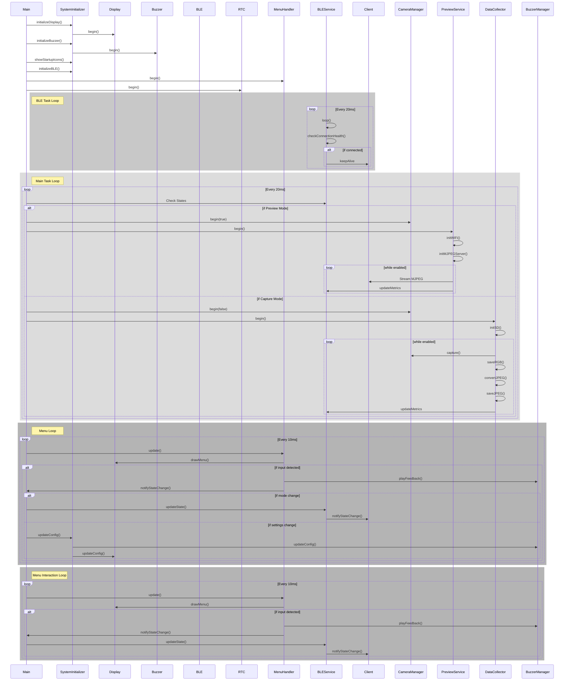

# Sequence Diagram

```mermaid
sequenceDiagram
    participant Main
    participant SystemInitializer
    participant Display
    participant Buzzer
    participant BLE
    participant RTC
    participant MenuHandler

    Main->>SystemInitializer: initializeDisplay()
    SystemInitializer->>Display: begin()
    Main->>SystemInitializer: initializeBuzzer()
    SystemInitializer->>Buzzer: begin()
    Main->>SystemInitializer: showStartupIcons()
    Main->>SystemInitializer: initializeBLE()
    Main->>MenuHandler: begin()
    Main->>RTC: begin()

    rect rgb(200, 200, 200)
        note right of Main: BLE Task Loop
        loop Every 20ms
            BLEService->>BLEService: loop()
            BLEService->>BLEService: checkConnectionHealth()
            alt if connected
                BLEService->>Client: keepAlive
            end
        end
    end

    rect rgb(220, 220, 220)
        note right of Main: Main Task Loop
        loop Every 20ms
            Main->>BLEService: Check States
            alt if Preview Mode
                Main->>CameraManager: begin(true)
                Main->>PreviewService: begin()
                PreviewService->>PreviewService: initWiFi()
                PreviewService->>PreviewService: initMJPEGServer()
                loop while enabled
                    PreviewService->>Client: Stream MJPEG
                    PreviewService->>BLEService: updateMetrics
                end
            else if Capture Mode
                Main->>CameraManager: begin(false)
                Main->>DataCollector: begin()
                DataCollector->>DataCollector: initSD()
                loop while enabled
                    DataCollector->>CameraManager: capture()
                    DataCollector->>DataCollector: saveRGB()
                    DataCollector->>DataCollector: convertJPEG()
                    DataCollector->>DataCollector: saveJPEG()
                    DataCollector->>BLEService: updateMetrics
                end
            end
        end
    end

    rect rgb(180, 180, 180)
        note right of Main: Menu Loop
        loop Every 10ms
            Main->>MenuHandler: update()
            MenuHandler->>Display: drawMenu()
            
            alt if input detected
                MenuHandler->>BuzzerManager: playFeedback()
                MenuHandler->>Main: notifyStateChange()
                alt if mode change
                    Main->>BLEService: updateState()
                    BLEService->>Client: notifyStateChange()
                else if settings change
                    Main->>SystemInitializer: updateConfig()
                    SystemInitializer->>BuzzerManager: updateConfig()
                    SystemInitializer->>Display: updateConfig()
                end
            end
        end
    end

    rect rgb(180, 180, 180)
        note right of Main: Menu Interaction Loop
        loop Every 10ms
            Main->>MenuHandler: update()
            MenuHandler->>Display: drawMenu()
            alt if input detected
                MenuHandler->>BuzzerManager: playFeedback()
                MenuHandler->>Main: notifyStateChange()
                Main->>BLEService: updateState()
                BLEService->>Client: notifyStateChange()
            end
        end
    end
```
