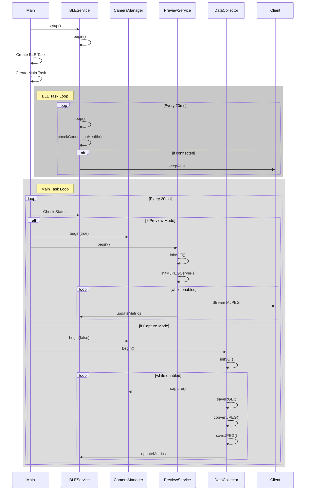

```mermaid
sequenceDiagram
    participant Main
    participant BLEService
    participant CameraManager
    participant PreviewService
    participant DataCollector
    participant Client

    Main->>BLEService: setup()
    BLEService->>BLEService: begin()
    Main->>Main: Create BLE Task
    Main->>Main: Create Main Task

    rect rgb(200, 200, 200)
        note right of Main: BLE Task Loop
        loop Every 20ms
            BLEService->>BLEService: loop()
            BLEService->>BLEService: checkConnectionHealth()
            alt if connected
                BLEService->>Client: keepAlive
            end
        end
    end

    rect rgb(220, 220, 220)
        note right of Main: Main Task Loop
        loop Every 20ms
            Main->>BLEService: Check States
            alt if Preview Mode
                Main->>CameraManager: begin(true)
                Main->>PreviewService: begin()
                PreviewService->>PreviewService: initWiFi()
                PreviewService->>PreviewService: initMJPEGServer()
                loop while enabled
                    PreviewService->>Client: Stream MJPEG
                    PreviewService->>BLEService: updateMetrics
                end
            else if Capture Mode
                Main->>CameraManager: begin(false)
                Main->>DataCollector: begin()
                DataCollector->>DataCollector: initSD()
                loop while enabled
                    DataCollector->>CameraManager: capture()
                    DataCollector->>DataCollector: saveRGB()
                    DataCollector->>DataCollector: convertJPEG()
                    DataCollector->>DataCollector: saveJPEG()
                    DataCollector->>BLEService: updateMetrics
                end
            end
        end
    end
```
