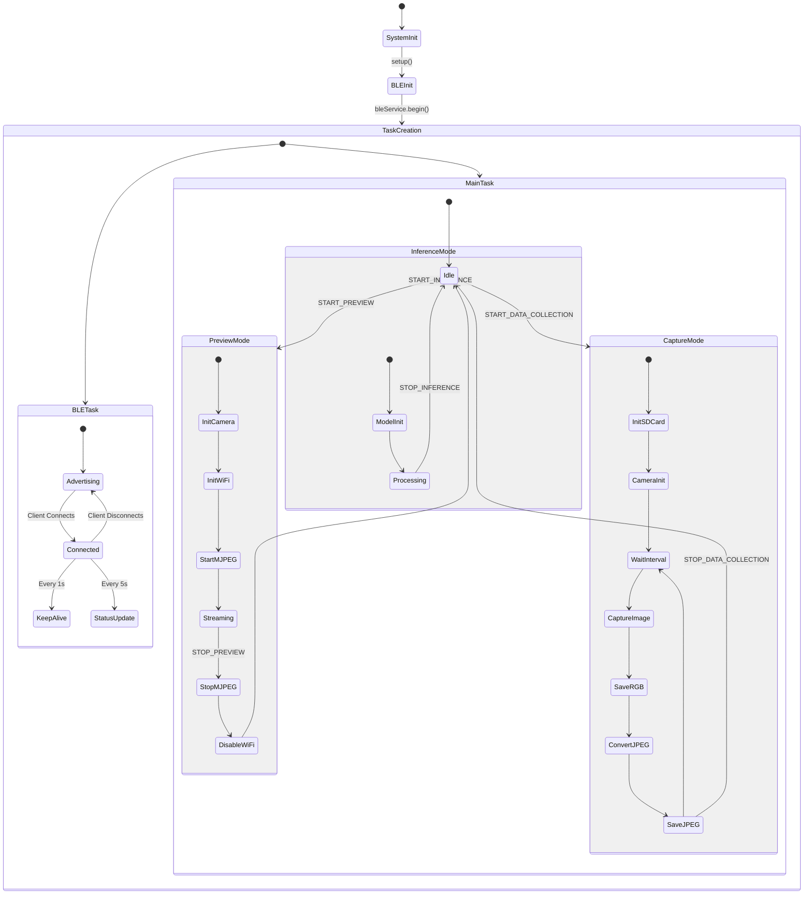

# State Diagram

```mermaid
stateDiagram-v2
    [*] --> SystemInit
    SystemInit --> BLEInit: setup()
    BLEInit --> TaskCreation: bleService.begin()

    state TaskCreation {
        [*] --> BLETask
        [*] --> MainTask
    }

    state MainTask {
        [*] --> Idle
        Idle --> PreviewMode: START_PREVIEW
        Idle --> CaptureMode: START_DATA_COLLECTION
        Idle --> InferenceMode: START_INFERENCE

        state PreviewMode {
            [*] --> InitCamera
            InitCamera --> InitWiFi
            InitWiFi --> StartMJPEG
            StartMJPEG --> Streaming
            Streaming --> StopMJPEG: STOP_PREVIEW
            StopMJPEG --> DisableWiFi
            DisableWiFi --> Idle
        }

        state CaptureMode {
            [*] --> InitSDCard
            InitSDCard --> CameraInit
            CameraInit --> WaitInterval
            WaitInterval --> CaptureImage
            CaptureImage --> SaveRGB
            SaveRGB --> ConvertJPEG
            ConvertJPEG --> SaveJPEG
            SaveJPEG --> WaitInterval
            SaveJPEG --> Idle: STOP_DATA_COLLECTION
        }

        state InferenceMode {
            [*] --> ModelInit
            ModelInit --> Processing
            Processing --> Idle: STOP_INFERENCE
        }
    }

    state BLETask {
        [*] --> Advertising
        Advertising --> Connected: Client Connects
        Connected --> Advertising: Client Disconnects
        Connected --> KeepAlive: Every 1s
        Connected --> StatusUpdate: Every 5s
    }
```
