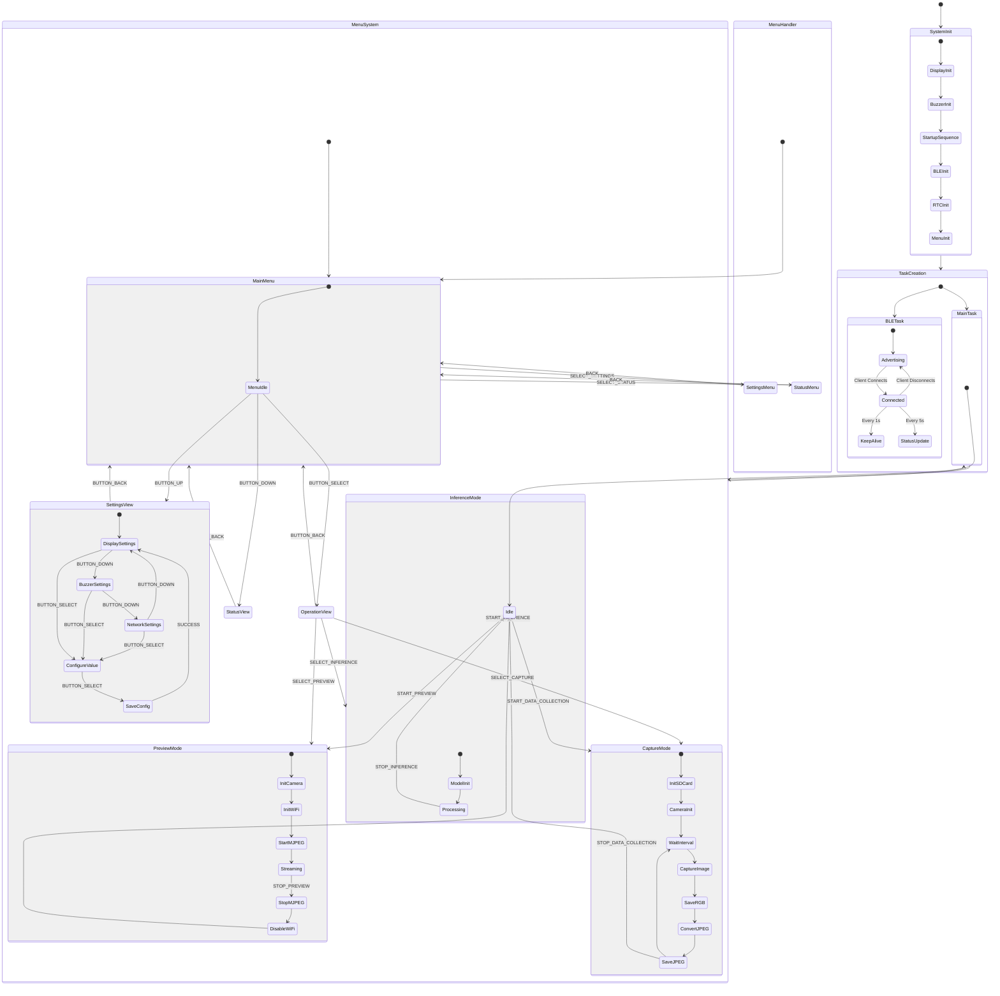

# State Diagram

```mermaid
stateDiagram-v2
    [*] --> SystemInit
    
    state SystemInit {
        [*] --> DisplayInit
        DisplayInit --> BuzzerInit
        BuzzerInit --> StartupSequence
        StartupSequence --> BLEInit
        BLEInit --> RTCInit
        RTCInit --> MenuInit
    }

    SystemInit --> TaskCreation

    state TaskCreation {
        [*] --> BLETask
        [*] --> MainTask
    }

    state MainTask {
        [*] --> Idle
        Idle --> PreviewMode: START_PREVIEW
        Idle --> CaptureMode: START_DATA_COLLECTION
        Idle --> InferenceMode: START_INFERENCE

        state PreviewMode {
            [*] --> InitCamera
            InitCamera --> InitWiFi
            InitWiFi --> StartMJPEG
            StartMJPEG --> Streaming
            Streaming --> StopMJPEG: STOP_PREVIEW
            StopMJPEG --> DisableWiFi
            DisableWiFi --> Idle
        }

        state CaptureMode {
            [*] --> InitSDCard
            InitSDCard --> CameraInit
            CameraInit --> WaitInterval
            WaitInterval --> CaptureImage
            CaptureImage --> SaveRGB
            SaveRGB --> ConvertJPEG
            ConvertJPEG --> SaveJPEG
            SaveJPEG --> WaitInterval
            SaveJPEG --> Idle: STOP_DATA_COLLECTION
        }

        state InferenceMode {
            [*] --> ModelInit
            ModelInit --> Processing
            Processing --> Idle: STOP_INFERENCE
        }
    }

    state BLETask {
        [*] --> Advertising
        Advertising --> Connected: Client Connects
        Connected --> Advertising: Client Disconnects
        Connected --> KeepAlive: Every 1s
        Connected --> StatusUpdate: Every 5s
    }

    state MenuHandler {
        [*] --> MainMenu
        MainMenu --> SettingsMenu: SELECT_SETTINGS
        MainMenu --> StatusMenu: SELECT_STATUS
        SettingsMenu --> MainMenu: BACK
        StatusMenu --> MainMenu: BACK
    }

    state MenuSystem {
        [*] --> MainMenu
        
        state MainMenu {
            [*] --> MenuIdle
            MenuIdle --> SettingsView: BUTTON_UP
            MenuIdle --> StatusView: BUTTON_DOWN
            MenuIdle --> OperationView: BUTTON_SELECT
        }
        
        state SettingsView {
            [*] --> DisplaySettings
            DisplaySettings --> BuzzerSettings: BUTTON_DOWN
            BuzzerSettings --> NetworkSettings: BUTTON_DOWN
            NetworkSettings --> DisplaySettings: BUTTON_DOWN
            DisplaySettings --> ConfigureValue: BUTTON_SELECT
            BuzzerSettings --> ConfigureValue: BUTTON_SELECT
            NetworkSettings --> ConfigureValue: BUTTON_SELECT
            ConfigureValue --> SaveConfig: BUTTON_SELECT
            SaveConfig --> DisplaySettings: SUCCESS
        }
        
        SettingsView --> MainMenu: BUTTON_BACK
        StatusView --> MainMenu: BUTTON_BACK
        OperationView --> MainMenu: BUTTON_BACK
        
        OperationView --> PreviewMode: SELECT_PREVIEW
        OperationView --> CaptureMode: SELECT_CAPTURE
        OperationView --> InferenceMode: SELECT_INFERENCE
    }

    MainTask --> MenuSystem
    MenuSystem --> MainTask
```
